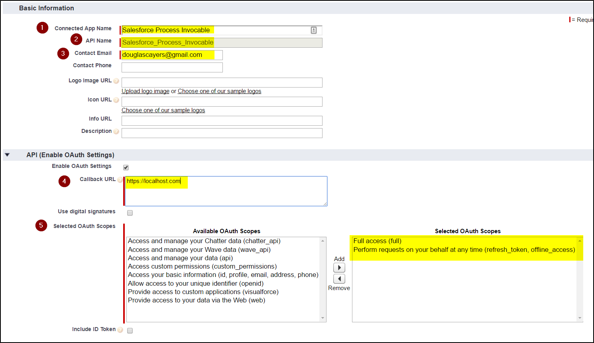
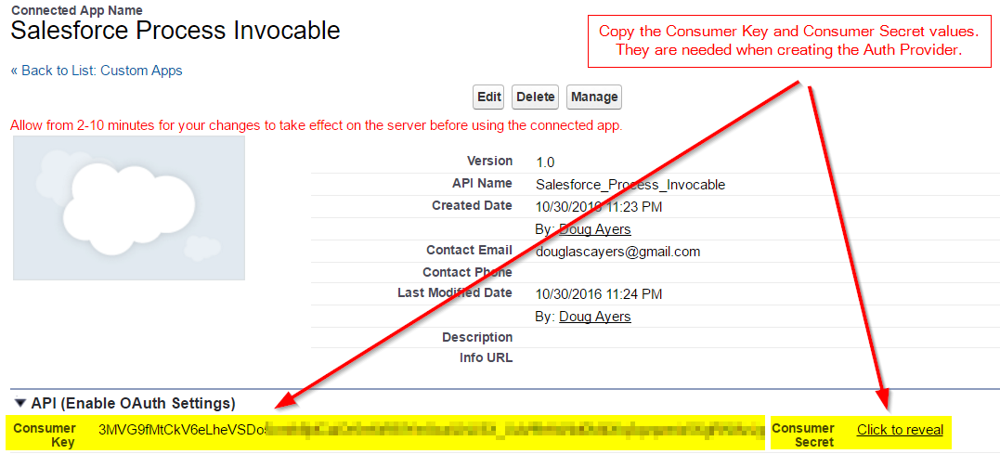
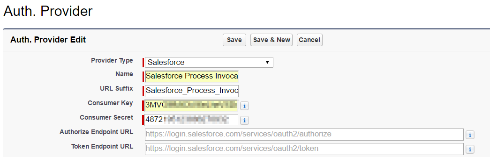
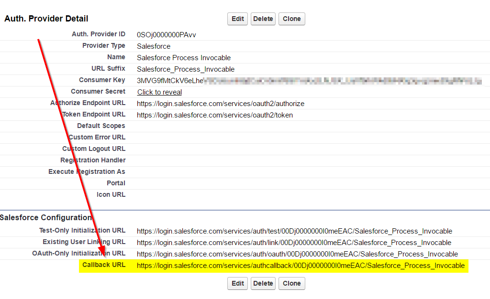
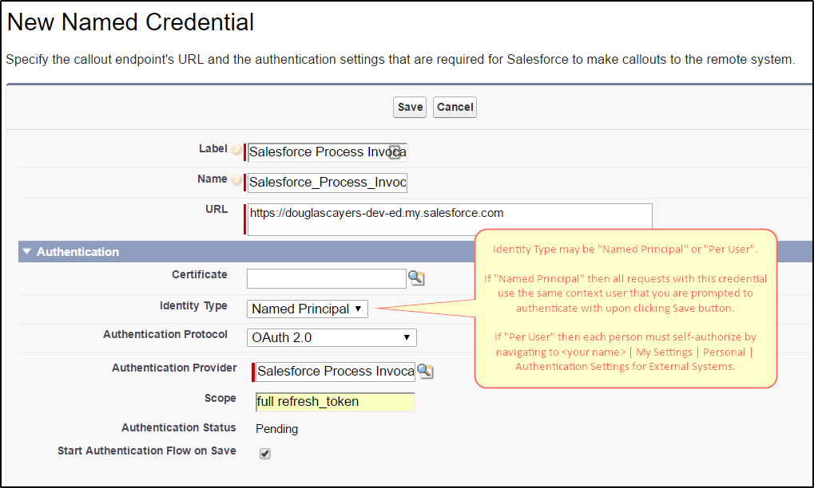

# Launch invocable Processes from Flow or Apex on-demand

Invocable Processes were introduced in the [Winter '17 release](https://releasenotes.docs.salesforce.com/en-us/winter17/release-notes/rn_forcecom_process_in_process.htm).

So at the time of the release, these were the ways in which Processes and Flows could be invoked by each other:
* [Processes invoke Processes](https://help.salesforce.com/articleView?id=process_action_invoke_process.htm)
* [Processes invoke Flows](https://help.salesforce.com/articleView?id=process_action_flow.htm)
* [Flows invoke Flows (sub-flows)](https://developer.salesforce.com/docs/atlas.en-us.204.0.salesforce_vpm_guide.meta/salesforce_vpm_guide/vpm_designer_elements_subflow.htm)
* ... but Flows could not invoke Processes ...

This code aims to fill that gap.

Also note in the Winter '17 release that the ability to invoke Processes is available in
the [Actions REST API](https://developer.salesforce.com/docs/atlas.en-us.api_action.meta/api_action/actions_obj_flow.htm).
This code fills the functionality gap to enable Flows to invoke Processes
by way of [invocable apex](https://developer.salesforce.com/docs/atlas.en-us.salesforce_vpm_guide.meta/salesforce_vpm_guide/vpm_designer_elements_apex_invocable.htm) that makes the http request to the REST API.

The benefit is that Flows can on-demand call reusable Processes!

Please note, since the Salesforce REST API [requires OAuth authentication](https://developer.salesforce.com/docs/atlas.en-us.api_rest.meta/api_rest/intro_understanding_authentication.htm), we have to use
[Named Credentials](https://developer.salesforce.com/docs/atlas.en-us.apexcode.meta/apexcode/apex_callouts_named_credentials.htm) when making the http request, so there is some extra
setup by the admin and potentially by the end-users before this solution can be used.

Setup
-----

Since the Salesforce REST API [requires OAuth authentication](https://developer.salesforce.com/docs/atlas.en-us.api_rest.meta/api_rest/intro_understanding_authentication.htm), we have to use
[Named Credentials](https://developer.salesforce.com/docs/atlas.en-us.apexcode.meta/apexcode/apex_callouts_named_credentials.htm).

Follow these steps to setup a Named Credential that authenticates to your Salesforce org. The name of this Named Credential will be used when you create your Flow to use the **ProcessInvocable** element.

**Create Connected App** ([documentation](https://help.salesforce.com/articleView?id=connected_app_create.htm))

1. In Setup, navigate to `Create | Apps`.
2. Find Connected Apps section then click New button
    1. Enter a name for your app (e.g. Salesforce Process Invocable)
    2. Enter your admin email address
    3. Callback URL, for now, just enter https://localhost.com but we will change this later
    4. Select OAuth Scopes `Full access` and `Perform requests on your behalf at any time`
    5. Click Save button
    6. Take note of the generated **Consumer Key** and **Consumer Secret** values

**Create Auth Provider** ([documentation](https://help.salesforce.com/articleView?id=sso_provider_sfdc.htm))

1. In Setup, navigate to `Security Controls | Auth. Providers`
2. Click New button
    1. Provider Type, choose Salesforce
    2. Enter a name for your auth provider (e.g. Salesforce Process Invocable)
    3. Consumer Key, enter the value from your Connected App
    4. Consumer Secret, enter the value from your Connected App
    5. Click Save button
    6. Copy the generated **Callback URL** and update your Connected App with this new value. Once the Connected App's callback url is updated, do wait 10 minutes for the change to propogate otherwise you may get errors in the final step of setup.

**Created Named Credential** ([documentation](https://help.salesforce.com/articleView?id=named_credentials_define.htm))

Usage
-----

Create an invocable Process

Create a Flow that uses the **ProcessInvocable** Apex action from the palette

You can pass multiple Salesforce record IDs to the Process you want to invoke.

Or, you can pass single Salesforce record ID to the Process you want to invoke.

Input Parameters
----------------

These are the input parameters when configuring the **ProcessInvocable** element on the Flow canvas.

| Parameter Name   | Description | Required? |
|------------------|-------------|-----------|
| Process Name     | Unique API Name of the Process or Flow to invoke. | Yes |
| Named Credential | The Named Credential to use to authenticate to Salesforce REST API when making http callouts to invoke the Process or Flow. | Yes |
| API Version      | The REST API version to use when calling Actions API to invoke the Process or Flow. Should be 38.0 or greater. | Yes |
| Record IDs       | Variable Collection of Salesforce record IDs that the Process or Flow will execute on. Must all be of the same object type. Either `Record IDs` or `Record ID` must be specifid. | No |
| Record ID        | Salesforce reocrd ID that the Process or Flow will execute on. Either `Record IDs` or `Record ID` must be specifid. | No |

When needing to run multiple records through the same Process, build up a `Collection Variable` in your Flow then use the `Record IDs` collection input parameter.
For performance, this will make one HTTP request to the REST API passing in all the record IDs together rather than making multiple HTTP requests.
https://developer.salesforce.com/docs/atlas.en-us.api_action.meta/api_action/actions_intro_invoking.htm