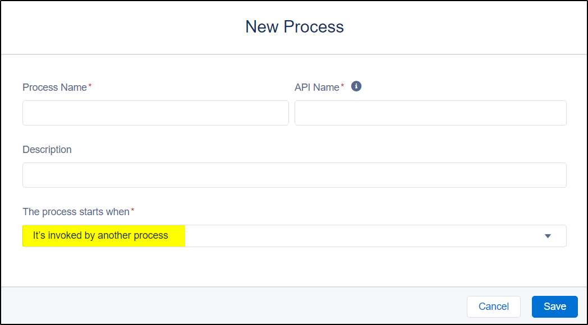
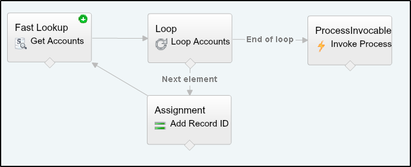
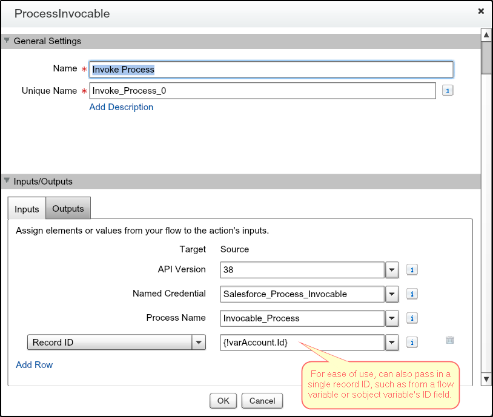

# Launch invocable Processes from Flow or Apex on-demand

Invocable Processes were introduced in the [Winter '17 release](https://releasenotes.docs.salesforce.com/en-us/winter17/release-notes/rn_forcecom_process_in_process.htm).

So at the time of the release, these were the ways in which Processes and Flows could be invoked by each other:
* [Processes invoke Processes](https://help.salesforce.com/articleView?id=process_action_invoke_process.htm)
* [Processes invoke Flows](https://help.salesforce.com/articleView?id=process_action_flow.htm)
* [Flows invoke Flows (sub-flows)](https://developer.salesforce.com/docs/atlas.en-us.204.0.salesforce_vpm_guide.meta/salesforce_vpm_guide/vpm_designer_elements_subflow.htm)
* ... but Flows could not invoke Processes ...

This code aims to fill that gap.

Also note in the Winter '17 release that the ability to invoke Processes is available in
the [Actions REST API](https://developer.salesforce.com/docs/atlas.en-us.api_action.meta/api_action/actions_obj_flow.htm).
This code exposes fills the functionality gap to enable Flows to invoke Processes
by way of invocable apex that makes the http request to the REST API.

The benefit is that Flows can on-demand call reusable Processes!

However, since the Salesforce REST API [requires OAuth authentication](https://developer.salesforce.com/docs/atlas.en-us.api_rest.meta/api_rest/intro_understanding_authentication.htm), we have to use
[Named Credentials](https://developer.salesforce.com/docs/atlas.en-us.apexcode.meta/apexcode/apex_callouts_named_credentials.htm) when making the http request, so there is some extra
setup by the admin and potentially by the end-users before this solution can be used.

Setup
-----

Usage
-----

1. Create an invocable Process

2. Create a Flow that uses the **ProcessInvocable** Apex action from the palette

3a. You can pass multiple Salesforce record IDs to the Process you want to invoke.

3c. Or, you can pass single Salesforce record ID to the Process you want to invoke.

Input Parameters
----------------

These are the input parameters when configuring the **ProcessInvocable** element on the Flow canvas.

| Parameter Name   | Description | Required? |
|------------------|-------------|-----------|
| Process Name     | Unique API Name of the Process or Flow to invoke. | Yes |
| Named Credential | The Named Credential to use to authenticate to Salesforce REST API when making http callouts to invoke the Process or Flow. | Yes |
| API Version      | The REST API version to use when calling Actions API to invoke the Process or Flow. Should be 38.0 or greater. | Yes |
| Record IDs       | Variable Collection of Salesforce record IDs that the Process or Flow will execute on. Must all be of the same object type. Either `Record IDs` or `Record ID` must be specifid. | No |
| Record ID        | Salesforce reocrd ID that the Process or Flow will execute on. Either `Record IDs` or `Record ID` must be specifid. | No |

When needing to run multiple records through the same Process, build up a `Collection Variable` in your Flow then use the `Record IDs` collection input parameter.
For performance, this will make one HTTP request to the REST API passing in all the record IDs together rather than making multiple HTTP requests.
https://developer.salesforce.com/docs/atlas.en-us.api_action.meta/api_action/actions_intro_invoking.htm